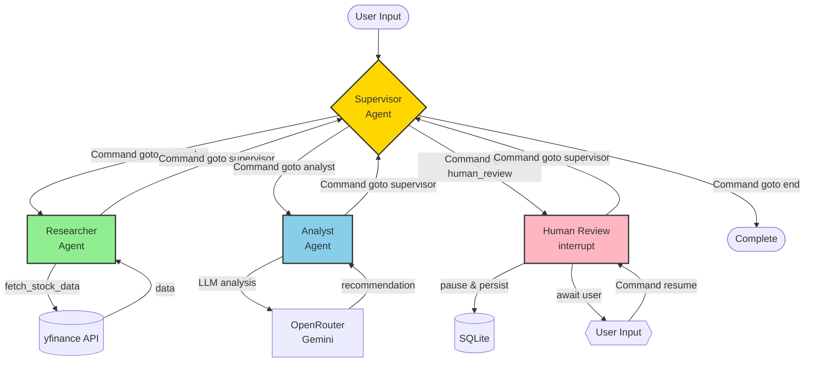

# Stock Intelligence Multi-Agent System

A **LangGraph-based multi-agent system** for intelligent stock analysis featuring:

- **Multi-Agent Architecture**: Supervisor-orchestrated researcher and analyst agents
- **Human-in-the-Loop**: Interrupt-based approval workflow before recommendations
- **Session Memory**: In-memory checkpointer for conversation state
- **Beautiful CLI**: Rich library for professional terminal UI
- **Real-Time Data**: yfinance integration for live stock market data
- **Free LLM**: OpenRouter with Gemini 2.0 Flash Lite (no API costs)

---

## Architecture



### Agent Responsibilities

| Agent | Role | Tools |
|-------|------|-------|
| **Supervisor** | Orchestrates workflow, routes between agents | Command pattern routing |
| **Researcher** | Fetches stock data (price, fundamentals, news) | yfinance API |
| **Analyst** | Synthesizes data into investment recommendation | LLM (Gemini via OpenRouter) |
| **Human Review** | Approves/rejects recommendation | interrupt() for user input |

---

## Quick Start

### Prerequisites

- Python 3.10+ (3.11-3.13 recommended)
- [uv package manager](https://github.com/astral-sh/uv) installed
- OpenRouter API key ([Get free key](https://openrouter.ai))

### Installation

1. **Clone repository**
   ```bash
   git clone https://github.com/yourusername/cli-stock-picker.git
   cd cli-stock-picker
   ```

2. **Install dependencies with uv**
   ```bash
   uv sync
   ```

3. **Configure environment**
   ```bash
   cp .env.example .env
   # Edit .env and add your OPENROUTER_API_KEY
   ```

### Run Analysis

```bash
uv run python main.py
```

**Example Session:**
```
╔═══════════════════════════════════════════════════════════╗
║           STOCK INTELLIGENCE                              ║
╠═══════════════════════════════════════════════════════════╣
║ # Stock Intelligence Multi-Agent System                   ║
║                                                            ║
║ Powered by LangGraph | OpenRouter | yfinance              ║
╚═══════════════════════════════════════════════════════════╝

Enter a stock ticker symbol to analyze
Examples: AAPL, GOOGL, MSFT, TSLA

Ticker: AAPL

[R] RESEARCHER
╭─────────────────────────────────────────────╮
│ Research complete for AAPL. Key data...    │
╰─────────────────────────────────────────────╯

[A] ANALYST
╭─────────────────────────────────────────────╮
│ Investment Analysis for AAPL:              │
│                                            │
│ Recommendation: BUY                        │
│ Confidence: High                           │
│ ...                                        │
╰─────────────────────────────────────────────╯

================================================================================
>> HUMAN REVIEW REQUIRED
================================================================================

Options:
  • Type APPROVE to accept
  • Type REJECT to decline

Your decision: APPROVE

================================================================================
[OK] ANALYSIS COMPLETE
================================================================================
```

---

## Project Structure

```
cli-stock-picker/
├── src/
│   ├── __init__.py          # Package initialization
│   ├── state.py             # AgentState (Pydantic schema)
│   ├── tools.py             # yfinance data fetching
│   ├── agents.py            # Agent node functions
│   ├── graph.py             # LangGraph orchestration
│   └── config.py            # LLM and environment config
├── data/
│   └── checkpoints.db       # SQLite persistence (auto-created)
├── main.py                  # CLI entry point
├── pyproject.toml           # uv dependencies
├── .env.example             # Environment template
├── .env                     # Your API keys (git-ignored)
├── .gitignore
└── README.md
```

---

## Technical Details

### State Management

Uses **Pydantic BaseModel** with `add_messages` reducer for type-safe state:

```python
class AgentState(BaseModel):
    messages: Annotated[Sequence[BaseMessage], add_messages]
    ticker: Optional[str]
    research_data: Optional[dict]
    analysis_summary: Optional[str]
    user_decision: Optional[str]
```

### Command Pattern

Modern LangGraph routing (2025/2026 standard):

```python
def supervisor_node(state: AgentState) -> Command[Literal["researcher", "analyst", "human_review", "__end__"]]:
    if not state.research_data:
        return Command(goto="researcher", update={...})
    # ... routing logic
```

### Human-in-the-Loop

Uses `interrupt()` to pause execution:

```python
def human_review_node(state: AgentState) -> Command[Literal["supervisor"]]:
    user_input = interrupt("Do you approve this recommendation?")
    # Resume via: graph.stream(Command(resume=user_input), config)
```

### Persistence

In-memory checkpointer for session state management:

```python
from langgraph.checkpoint.memory import MemorySaver
checkpointer = MemorySaver()
graph = workflow.compile(checkpointer=checkpointer)
```

---

## Key Technologies

- **[LangGraph 1.0](https://langchain-ai.github.io/langgraph/)**: State machine orchestration
- **[Pydantic 2.0](https://docs.pydantic.dev/)**: Runtime validation and type safety
- **[OpenRouter](https://openrouter.ai/)**: Unified LLM API (free Gemini tier)
- **[yfinance](https://pypi.org/project/yfinance/)**: Real-time stock market data
- **[Rich](https://rich.readthedocs.io/)**: Beautiful terminal UI
- **[uv](https://github.com/astral-sh/uv)**: Fast Python package manager

---

## Features Demonstrated

### LangGraph Patterns (2025/2026)
- StateGraph with Command pattern
- Multi-agent supervisor architecture
- Pydantic state schema with reducers
- Human-in-the-loop with interrupt()
- MemorySaver for session state
- Streaming execution updates

### Software Engineering
- Clean architecture (separation of concerns)
- Type hints throughout
- Google-style docstrings
- Professional error handling
- Logging and observability
- Environment-based configuration

### Portfolio Quality
- Professional README with Mermaid diagram
- Clean CLI with Rich UI
- Modular, testable code
- Production-ready patterns
- Extensible design for future agents

---

## Future Enhancements

- Add Technical Analyst agent for chart pattern analysis
- Implement Risk Manager agent for portfolio balancing
- Add News Sentiment agent with NLP analysis
- Database persistence (PostgreSQL/SQLite) for production
- Web UI with Streamlit or FastAPI
- Backtesting framework with historical data
- Real-time alerting for price movements
- Multi-stock portfolio optimization

---

## Contributing

Contributions are welcome. Areas for improvement:
- Additional agent types (sentiment analysis, technical indicators)
- Enhanced error recovery and retry logic
- Unit tests for agent nodes
- Integration tests for full workflow
- Performance optimizations for large portfolios

---

## License

MIT License - See LICENSE file for details

---

## Acknowledgments

Built with:
- [LangChain](https://www.langchain.com/) - Agentic framework
- [OpenRouter](https://openrouter.ai/) - LLM API gateway
- [Yahoo Finance](https://finance.yahoo.com/) - Market data provider
